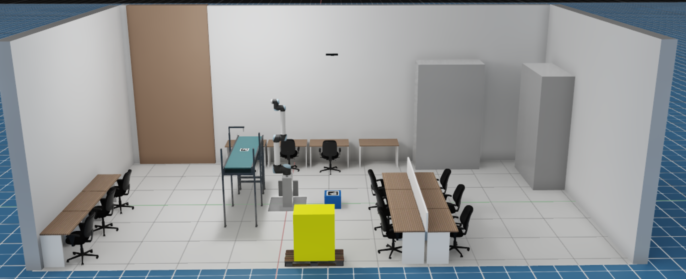

# Smart Factoring Simulation Scene

This folder contains the 3D simulation environment for the Smart Factory cell, used with **NVIDIA Isaac Sim** and integrated with **ROS 2 Jazzy**.

---

## 📁 Folder Structure

- `assets/`: Contains custom meshes, materials, and static components (e.g. walls, table, conveyor)
- `scenes/`: Main `.usd` files used for the simulation in Isaac Sim
- `scripts/`: Python scripts used to generate or configure the scene

---


## 🖼️ Scene Preview



> *This image shows the core elements of the simulation: robot, workspace, and factory layout.*

---

## How to Open in Isaac Sim

### 1. Run Isaac Sim:

```bash
cd isaacsim/_build/linux-x86_64/release
./isaac-sim.sh
```
### 2. In the Isaac Sim menu, go to File → Open
### 3. Open the scene:
```bash
smartfactoring_isaac/scenes/smartfactoring_world.usda
```

## Notes

- The scene must be opened manually in Isaac Sim via the UI or command line
- No Action Graphs are included — all control is handled via ROS 2

